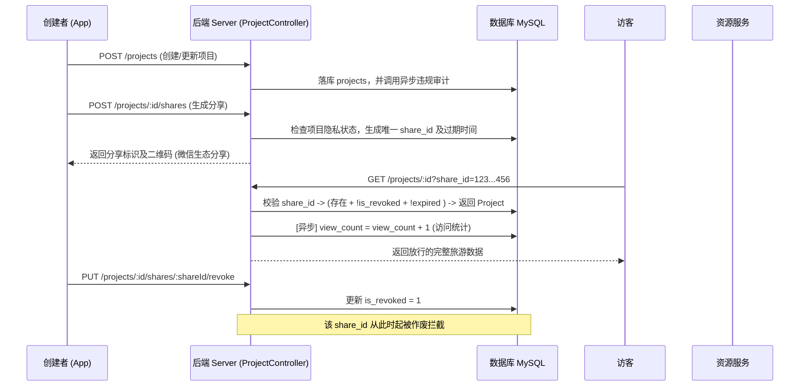

# 模块 3：行程项目与协作共享体系 答辩清单

## 1. 模块职责概述
本模块是系统的“骨架”，提供旅行项目（Project）的基础信息管理（CRUD）、置顶排序等功能；同时该模块搭建了一套细粒度的分享与授权机制，允许用户生成带时效与状态控制的分享链接或二维码，控制其他用户/游客对特定行程记录的访问权限。

## 2. 核心代码链路说明
*   **前端（小程序端）**：
    *   **核心逻辑**：客户端调用 `/projects` 相关接口获取行程列表或创建新行程。可以通过分享页面请求后端生成分享链接或带有 UUID 的二维码供游客扫码。
    *   **分享接力**：扫码后走 `visitProjectShare` 统计曝光率，并附带 `share_id` 的 token 请求具体资源做鉴权。
*   **后端（Node.js 端）**：
    *   **Controller (`src/controllers/projectController.js`)**：暴露RESTful资源路由（涵盖查询、置顶、分享记录的创建与撤销扫码等）。
    *   **Service (`src/services/projectService.js`)**：组装复杂的列表过滤器（日期过滤、关键字筛选和标签模糊搜索），利用 Sequelize `literal` 子查询优化了经纬度数量的展示。还包办了敏感词并发异步送检 `queueProjectAudit`。
    *   **Service (`src/services/projectShareService.js`)**：管理基于 UUID (`share_id`) 的分享凭证过期控制；通过 `revokeProjectShare` 实现一键阻断已被分享的链接。
    *   **Models**：
        *   `project.js`：定义行程主体，含有 `is_pinned`/`pinned_at` 控制置顶排序，包含 `is_archived` 防止归档时误操作业务。
        *   `projectShare.js`：关联 `project_id` 的多实例记录，包含过期时间、浏览统计 (`view_count`) 与手动撤销位 (`is_revoked`)。

## 3. 架构与流程图

## 4. 亮点与技术难点实现解析
1.  **灵活的置顶与综合排序设计**：列表接口并没有通过把记录拿回后端做大排序，而是原生地在数据库 `ORDER BY is_pinned DESC, pinned_at DESC, created_at DESC` 执行。这套组合满足了复杂需求：先置顶项目靠前，再根据置顶操作时间排序，最后普适按照记录产生时间倒序排列。
2.  **安全可靠与具备时效的分享设计**：未使用单一数字自增做分享标避免被“遍历撞库”扫荡，而是为每次分享调用 Node.js 的 `randomUUID()` 颁发独立令牌。在 `ProjectShare` 表中既有 `expires_at` (自然衰减策略) 又提供了 `is_revoked` 及 `revoked_at` (紧急拉闸熔断机制)。
3.  **ORM 子查询降低 N+1 查询风险**：前端展示列表时经常需要显示“有多少条带定位的打卡记录”，传统应用容易写出 N 遍子查逻辑甚至取到代码服务内存 `.length`。这套代码直接在 Attributes 里加入了 Sequelize `literal` 的 `SELECT COUNT(*)` 将它合并至一次 IO 响应中，大幅降低网络 RTT 消耗。

## 5. 答辩导师高频 Q&A 预测

### Q1: 当分享给好友看的时候，你是怎么判断这个用户到底有没有资格看这些内容的？
> **答辩话术**：在系统里我实现了双重隔离：如果你是公开项目，任何人可用。如果是私密（或限制）项目，你在点击“分享”的时候系统会为你的这次操作颁发一个独一无二的随机 `share_id` (UUID)。游客从微信卡片进入携带这个 `share_id` 请求底层接口，系统就会查询 `project_shares` 表判断这个码“是否已作废 (`is_revoked`)”或“是否已过期”。一旦成立该请求的权限上下文就会被暂时提升来获取该条项目，而绝不会泄漏同库其他私密项目。

### Q2: 这个二维码分享机制里，如果我把分享链接发到一个大群，瞬间有几万人点击，那个访问量的递增会不会把数据库锁死？
> **答辩话术**：如果有极大瞬时并发点击微信分享，由于每次访问都会给 `view_count` 做加一的操作，确实容易产生行锁竞争争抢问题（Hot Row）。在现在的标准小型系统设计上我依靠关系型数据库原生的加一语句原子更新度过前期；针对真正爆点的高并发行情，我会在服务中引入 Redis 做延时写入（Deferred Write/Batch Update）来拦截这些统计指标，或者将其送入消息队列（如 RabbitMQ 或者事件总线），平滑对数据库表的压力。

### Q3: 你的项目列表排序看起来写得很复杂啊，那项目越来越多你的查询怎么保证速度？
> **答辩话术**：这属于典型的关系列表优化。我为 `projects` 的表加了组合辅助索引——针对用户的频繁操作 `(user_id, is_pinned, pinned_at)` 的联合检索建立了索引。由于大多数人检索只查属于“自己”的项目，首先被过滤出的小批记录集，再去执行我写的基于日期的筛选或多字段 LIKE 模糊搜索。在小基数上使用LIKE的性能衰减也是可接受的，以此保持代码的高内聚并节省引入 ES(Elasticsearch) 的大资源消耗。