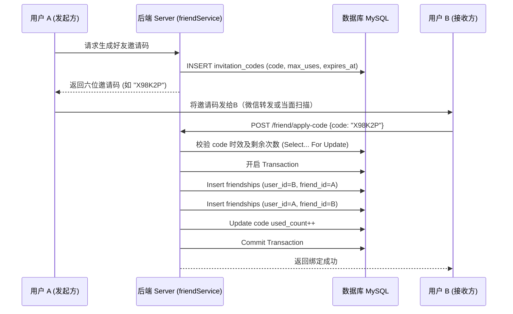

# 模块 4：社交与好友关系链设计 答辩清单

## 1. 模块职责概述
本模块承担了平台内的用户社交关系搭建诉求。设计了基于“邀请码（Invite Code）”的好友添加机制，同时在底层实现了互为独立的“双向关注（Friendship）”数据记录方式，满足用户对防骚扰、单方改备注以及“删好友”逻辑的强需求。

## 2. 核心代码链路说明
*   **前端（小程序端）**：
    *   **核心逻辑**：用户触发“面对面扫码”或粘贴好友码时调用通过解析得到的 code；同时可在好友列表长按好友设置备注或取消关联（删除）。
    *   **网络发包**：
        1. 建立关系：`/friend/invite-code` (生成邀请码) / `/friend/apply-code` (验码互相绑定)。
        2. 关系维护：`/friend/:friendId/remark` (PATCH 备注) / `/friend/:friendId` (DELETE 删除关系)。
*   **后端（Node.js 端）**：
    *   **Controller (`src/controllers/friendController.js`)**：暴露上述社交网关接口。
    *   **Service (`src/services/friendService.js`)**：
        *   提供 `randomInviteCode` 获取带有失效期与使用限制次数的字串。
        *   `listFriends` 负责通过联表/缓存机制捞取双方基础字段。
        *   `removeFriend` 应用了数据库显式事务（`sequelize.transaction`）对好友的双向双行记录进行原子性销毁。
    *   **Model (`src/models/friendship.js` & `invitationCode.js`)**：
        *   `friendships` 采用双主键（`user_id`, `friend_id`）方式，使得备注 `remark` 能依附到特定的主人身上。
        *   `invitation_codes` 具备 `max_uses` / `expires_at` 特性进行滥用阻拦。

## 3. 架构与流程图

## 4. 亮点与技术难点实现解析
1.  **“双向拆分”表设计赋能定制化体验**：由于涉及到复杂的微信社交体验（比如微信支持你给朋友改备注，但这备注只有你能看见；或者微信支持单删）。系统采用为一段“双向好友”建立“两条数据记录”。这样不管谁对谁设置 `remark`，数据归属永远独立，且解耦了 `user_id` 的查询。
2.  **防御邀请码滥采的高可用设计**：系统中的验证码带有 `max_uses` 和 `expires_at`；在 `applyInviteCode` 时利用事务和更新条数做并发控制防止被一人“多薅”。
3.  **删好友的数据库原子操作 (Transaction 机制)**：在 `removeFriend` 时，使用了 `sequelize.transaction`。既然之前绑定是互插两行，解除关系时也必须确保这两行均被移除，若因为数据库抖动中间 `destroy` 断裂，事务能保证回滚，杜绝系统出现“单向幽灵好友”错觉。而且配合外键以及逻辑解耦，未来也容易转化为“黑名单”机制。

## 5. 答辩导师高频 Q&A 预测

### Q1: 交友为什么不做“单条记录存储”，比如加个主键 `link_id` 连起 A 和 B，而要插两条重复的数据？
> **答辩话术**：最初设计时考虑过单行记录（如 `user_a, user_b, status`）。但这存在极大缺陷：第一是**不对称的社交属性难以存放**，比如 A 给 B 的备注，和 B 给 A 的备注放在一个表里结构会很别扭。第二是**索引查询效率**，在单条模式下要把自己所有的朋友查出来，查询语句需要变成 `user_a = ? OR user_b = ?`，如果表大了会面临 OR 查询的索引失效或降低情况。而双行模式虽然冗余了空间，但保证了只需要 `where user_id = ?` 直接命中，这是典型且高性价比的“空间换时间”优化策略。

### Q2: 邀请码有有效次数（max_uses），极端情况下两个人同时拿这个码去绑，怎么防止库存超卖（被多绑）的？
> **答辩话术**：在 `applyInviteCode` 中，我们要防止典型的并发竞争超卖。在数据库层面，校验完毕后，我在更新邀请码次数时会带上经典的乐观锁/行锁判断或者直接使用 `UPDATE invitation_codes SET used_count = used_count + 1 WHERE code = ? AND max_uses > used_count`。如果该语句返回受影响的行数为 0，说明在并发期间它的限制被耗尽了，代码层面即时抛出异常并回滚当前好友关系的建立事务。

### Q3: 微信社交体系里，如果 A 把 B 删除了，B 是不知道的。你们现在的删除逻辑怎么做？
> **答辩话术**：目前为了保持数据在数据库层面的一致洁净，我们调用的 `removeFriend` 接口在事务内进行了“双删”（各自从互相的列表中移除）。如果想要完全匹配微信这种“单删”、“僵尸粉”的机制，我们非常容易改造：原本的双删改成只执行 `Friendship.destroy({ where: { user_id: 主动方, friend_id: 被删方 } })`即可完成；或者保留记录，增加一个枚举字段 `relation_status = blocked/deleted` 进行前端的降级过滤，整体底层由于是分离设计，拓展成本极低。