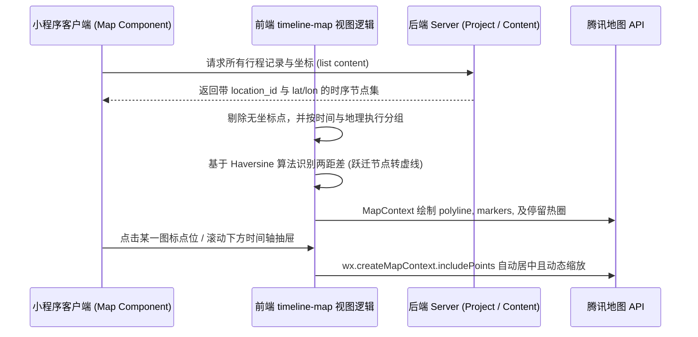

# 模块 5：地图与定位展示（LBS）与轨迹关联 答辩清单

## 1. 模块职责概述
本模块为“时间地图”提供空间可视化能力，利用腾讯地图与微信原生 LBS 功能实现照片、日记与录音沿真实地理坐标串联。重点解决了多天行程复杂经纬度连线（虚实切换与多天接库）、图钉状态聚合控制以及基于大屏幕抽屉的地理数据无缝双向交互联动。

## 2. 核心代码链路说明
*   **前端（小程序端）**：
    *   **核心逻辑**：位于 `TripTimeline/miniprogram/pages/timeline-map/` 以及 `TripTimeline/miniprogram/utils/tencentMap.ts`。
    *   **网络与LBS API**：
        1. 获取节点与坐标集后，将其按天分组成节点并计算点位 `MARKER_ACTIVE_ICON` 款式；
        2. 根据 `haversineKm` (球面哈弗辛距离算法) 切割线路（位移/交通段用虚线，漫步用实线），并通过腾讯 SDK 计算坐标热力圆圈（聚合）。
        3. 调用腾讯地图 `https://apis.map.qq.com/ws/place/v1/suggestion` 等 API 对坐标完成逆地理编码或主动选点录入。
*   **后端（Node.js 端）**：
    *   **Controller 与 Model**：对于需要保存 LBS 功能的节点，`location.js` 保存了经度(`longitude`), 纬度(`latitude`), 城市等全要素，关联到 `contents` 表中的 `location_id`。所有 LBS 解析的数据均在此集中分发展示。

## 3. 架构与流程图

## 4. 亮点与技术难点实现解析
1.  **科学的轨迹连线算法 (Visual Polylines Computation)**：为了避免记录中因为跨市高铁、飞机导致的死板直线遮挡了整块地图，前端利用了 `haversineKm` 算法求球面距离，当两个相邻图钉超过指定阈值 (`LONG_HOP_KM`, 即 1.5km)，会把连接线**切分为带箭头的飞线 / 虚线组合 (`dottedLine`)**；而连续短距离记为实线漫步路径，同时跨天的最后一点到第二天首先通过细灰虚线衔接设计。
2.  **空间聚集热力表现 (`buildStayCircles`)**：除了单点图钉绘制，对于频繁在一个较小纬度网格产生记录（例如在酒店/景点多次拍照），前端自行根据经纬度的字符串 Hash 做同化聚合，并以此推演出热力圈的显示。这使得用户可以清楚地发现旅行重点“驻足停留营地”。
3.  **动态防遮挡 UI 计算 (Padding Offset for Bottom Sheet)**：小程序的地图组件处于原生最高渲染层级，下面又存在自定义的时间轴可拖拽抽屉。在执行地图“聚焦包括该点”(`.includePoints`)操作时，通过 `calcMapBottomPadding()` 动态捕获用户设备的 `windowHeight` 并配合 `sheetHeight` Vh比例，计算出极确切的 Margin Bottom，彻底防止底部卡片把关键坐标锚点给挡住。

## 5. 答辩导师高频 Q&A 预测

### Q1: 如果我的系统里有一万个坐标点，全部扔进腾讯地图渲染会不会卡顿？怎么进行性能优化？
> **答辩话术**：如果有极大瞬时密集数据，原生端渲染确实会成为瓶颈并造成内存 OOM 卡顿跑慢。在本项目中我们做了两个级别的应对。首先我为处于非 Active（未激活）范围段的地段标记了 `joinCluster: true`，开启地图底层的原生网格自动聚合逻辑隐藏图钉。第二是我在抽屉提供了 `activeDayDate` 的按天过滤逻辑，用户点击顶部日期只会刷出当天数据并释放前后的 Polyline DOM内存，这也是大行程能够保持丝滑帧率的核心折中点。

### Q2: 你在算地图两点之间的间距时为什么不用最简单的平面直角坐标系算欧式距离而要自己写一层 `haversineKm` 的算法函数？
> **答辩话术**：因为地球是个椭球体。纬度相同的两点在赤道和在极地，它们实际在地表的跨度或者对应的弧长会有特别悬殊的差别。只有利用基于球面三角学设计的 `haversine` 算法，我们才能换算成准确的 km（千米）去标定。当我们设置阈值比如 “大于1.5km” 则表现为飞越虚线的时候，这个值必须足够工程严谨，平面欧式几何距离算出的误差完全没法达到商业系统的表现要求。

### Q3: 用户在上传一张很老的或者位置不对的照片时，他自己怎么通过LBS来纠正位置？
> **答辩话术**：我们的 EXIF 是辅助读取并不是强制绑定。对于老照片如果没有坐标，或者它被压缩抛弃了 EXIF 标签的，前端在编辑面板允许用户进入搜索关联业务，我们会去调我们写的 `searchTencentMapSuggestions`，利用了腾讯官方的地点提示补齐和 `reverseGeocodeTencentMap` 获取POI和街道，最后落地保存的实际是纠正后的合法定位，兼顾了应用的易用性和真实性。