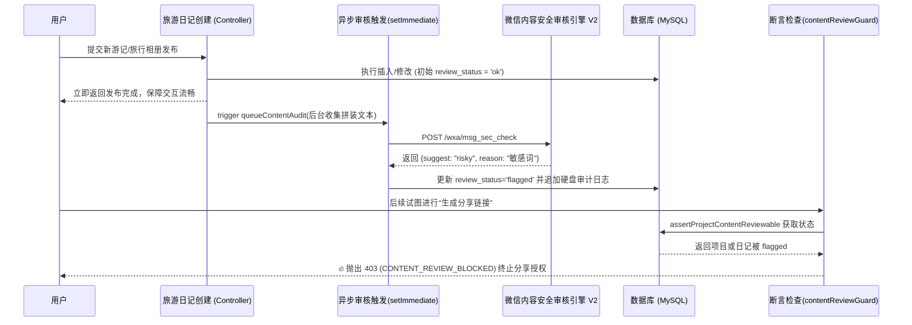

# 模块 6：内容安全审核与合规守门员逻辑 答辩清单

## 1. 模块职责概述
本模块扮演系统中的“内容安全合规网关”，主要为了应对微信小程序的审核上架要求和国内相关治安/安全法律法规。通过异步接入微信官方提供的“内容安全验证”（msgSecCheck），它能够识别违规日志、行程项目标语并在命中的情况下通过后端的阻断服务（Guard）阻止其后续流转或二次传播。

## 2. 核心代码链路说明
*   **后端（Node.js 端）核心工具与流程**：
    *   **触发点 (`projectService` & `contentService`)**：在创建或修改旅游项目和动态游记时，都会挂载 `queueProjectAudit` 或 `queueContentAudit`。这些函数收集待检查的 Title、Tags、RichHTML的纯文本副本，将它们组装成 `combined` 字段。
    *   **送检中心 (`src/services/wechatContentSecurity.js`)**：系统通过 `getWechatAccessToken` 获取服务凭证（Access Token），然后将文本裁剪至微信限制字数 (`2500` 字以内) 后发送至 `api.weixin.qq.com/wxa/msg_sec_check` 接口。
    *   **标记与日志录入 (`src/utils/auditLogger.js`)**：得到 `review` / `risky` 结果后，通过 Node.js 的 fs 模块异步追加持久化 JSON 行到日志 `logs/content-audit.log` 保证审计溯源。同时该业务还会立即回滚数据库表的 `review_status` 字段标记为 `flagged` 与 `review_reason`。
    *   **拦截网关 (`src/services/contentReviewGuard.js`)**：所有的分享操作 (创建连接) 都会调用此守门员组件执行 `assertProjectContentReviewable`，一旦查实主键下的实体拥有 `flagged` 标签，立即抛出 403 业务错误中断。

## 3. 架构与流程图

## 4. 亮点与技术难点实现解析
1.  **异步审计与主流程解耦机制 (`setImmediate`)**：内容检查的耗时和第三方接口的稳定性是极其不可控的（如网络抖动抛错）。系统对于提交和修改走后台 Node 的异步事件机制 `setImmediate` ——即时放行了用户的发圈反馈体验。同时所有审核逻辑里的异常块统统挂接了空捕捉并落盘记录，**“永远不抛出阻断异常”致使破坏主链路**。
2.  **合规闭环的拦截逻辑 (`assertProjectContentReviewable`)**：由于采用异步标记策略而可能使得违规内容成功落表（展示只对自己负责），此时系统借助守门员模式通过限制其“传播权”作为封锁控制，即用户只要命中合规标记池，便会被卡控抛错 `CONTENT_REVIEW_BLOCKED` 不允许分享，确保了恶劣内容无法从个人圈拓展到公域。
3.  **单行结构日志收集（Log Rotation 架构思考）**：采用无阻塞硬盘写入函数 (`fs.appendFile`) 流式压入，每条日志统一序列化成紧凑的 JSON 格式记录。当面对线上合规查纠或警察溯源时可以依靠脚本单行正则抽取分析。同时这种扁平独立的文件写入避开了臃肿的数据库设计牵制，且利于接驳未来 EFK (Elasticsearch/Filebeat/Kibana) 日志架构。

## 5. 答辩导师高频 Q&A 预测

### Q1: 如果你的审核是在后台异步跑的，也就意味着有极短的几十秒内，违规内容其实已经在你数据库里发布成功了，这个窗口期造成违规传播你没考虑拦截吗？
> **答辩话术**：有考虑过的。所以我的架构思路里做了一个“隔离带”。新发布的项目和游记，在初始状态下只展现给创建者“自己”看，这就相当于系统对敏感内容的内部宽容（自我欣赏并不违法）。当该用户想把这个行程分享到外部的同学和社交媒体时，他必定要走“生成分享权码”这个接口——而在这条要命的链路上，我写了阻塞的 `assertProjectContentReviewable` 强校验其状态；等他要分享时，这几十秒的异步检测早就完事并标记 `flagged` 给拦死了，这就有效堵住了公域传播漏洞。

### Q2: 如果请求微信检测的 accessToken 失效或微信官网宕机了，你的程序会停下让用户发不出日记吗？
> **答辩话术**：我设计的这个稽查管道体现了典型的“无阻塞旁路设计原则”。不管是发送请求出现网络中断、超时或者是 token 失效配置缺失，审核函数捕捉到的这个 Error 绝不会回抛到业务层。它仅仅会把自己的异常事件（如 `network_error`）写进本地的 `content-audit.log` 等待程序员去排查维护。这样即便审核服务暂时罢工掉线，用户仍然可以丝滑地发日记，做到了服务的高可用性降级。

### Q3: 微信文本检测似乎有一个字数长度限制，假如我写了一篇五万字的游记，检测会不会失败报错被弹回来？
> **答辩话术**：微信 V2 版本的检测接口推荐的检测长度在单次请求下是不超过两千五百来个字符的。因此我在中间写了个 `truncateForCheck` 单一职责函数，它会切走超出部分以最大截断送审；因为根据以往的样本工程规律，若游记包含黄赌毒和广告，在其前篇的两三千字中必然会高频出现词根。对于系统设计而言这种首部切断送审既保证了检测通过度又极大程度上兼顾了业务准确性。