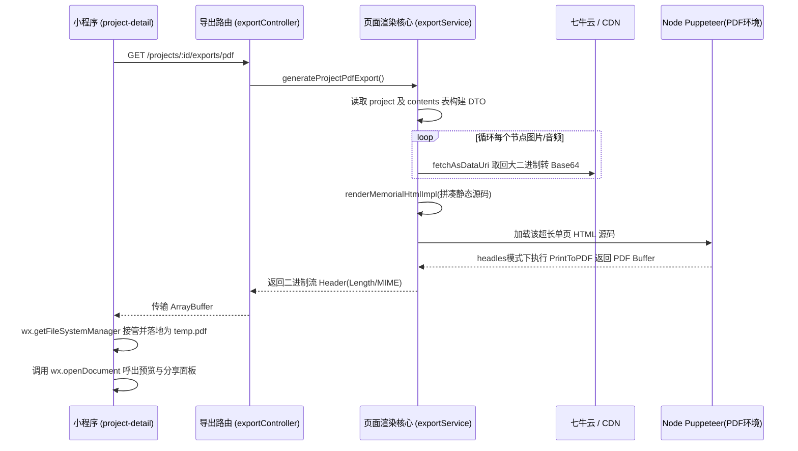

# 模块 7：PDF 文档导出与数据处理 答辩清单

## 1. 模块职责概述
本模块承担了整个系统中最重度的读计算聚合工作——“纪念册导出”。它支持将用户时间轴上的富文本、GPS 信息坐标、网络图片和录音（以媒体资源内联处理等方式）生成单一、可独立携带或打印的纯净版 HTML 以及可跨平台阅览的高清 PDF 文件。

## 2. 核心代码链路说明
*   **前端（小程序端）**：
    *   在 `TripTimeline/miniprogram/pages/project-detail/project-detail.ts` 中发起文件导出。
    *   通过 `saveRemoteBinaryToUserData` 自定义下载流封装，解决 `wx.downloadFile` 不能承载部分较长延时的 Puppeteer 计算连接断开问题。用 `wx.request { responseType: 'arraybuffer' }` 置换为本地临时文档（`wx.env.USER_DATA_PATH`）并在成功后调用 `wx.openDocument` 弹出系统分享菜单预览。
*   **后端（Node.js 端）**：
    *   **Controller (`exportController.js`)**：暴露 /html 和 /pdf 导出路由，关闭 HTTP Cache 并注入动态 Content-Disposition 及 `X-Export-Count` 自定义头信息。
    *   **导出业务逻辑 (`services/exportService.js` 等)**：
        1. **数据拉取**：查询项目和内容并按照时间排序。
        2. **资源内联解析（Data URI）**：执行 `createAssetResolvers` 和 `resolveAsset` 函数将远程七牛的 URL 或者本地相对路径图片、语音文件等全部读成 `base64` 编码。
        3. **模板聚合渲染 (`./export/memorialTemplate.js`)**：通过字符串拼接（SSR思想）构建纯净脱机使用的 HTML 源码。
        4. **PDF 打印 (`generateProjectPdfExport`)**：如为 PDF 请求，则将前一步生成的 HTML 交由无头浏览器 (如 Puppeteer 隐式转调处理流) 截图打印出 Buffer。

## 3. 架构与流程图

## 4. 亮点与技术难点实现解析
1.  **脱机运行的高清排版架构 (Data URI 内联降级)**：考虑到用户往往在导出版中希望长期保存甚至离线查阅，系统没有偷懒写 ``。而是手写了一层精密的 `resolveAsset` 及 `fetchAsDataUri`，不管对象在哪统统转成 `base64` 嵌在文档标签内。彻底做到了“文件即网格”，不论七牛空间是否欠费销毁它都永久独立渲染。
2.  **规避网关超时的心跳/大报文传输策略 (`saveRemoteBinaryToUserData`)**：生成 PDF 对服务端的 I/O 和计算渲染耗时很高（尤其是多图情况）。放弃了原生并不稳定的 `wx.downloadFile`，选用了 `responseType: 'arraybuffer'` 主动发网络请求去持久挂起等回应，一旦拿到分箱后立即由本地系统文件管理器落盘，极大保证了大报文不断流不出错。
3.  **多态异常情况的双轨降级通讯 (`parseErrorPayloadFromArrayBuffer`)**：由于强制使用 ArrayBuffer 的请求形式发起接收数据，一旦后台遇到阻断（例如`合规校验没过`报 Error），返回的不再是 PDF 而是 `application/json` 的报错；所以在网络返回模块刻意挂加了一个将字节数组强制按位解码 `String.fromCharCode` 的 JSON Parse 后备降梯来友好弹出中文提示拦截框。

## 5. 答辩导师高频 Q&A 预测

### Q1: 当一个旅客导出的排版图片特别庞大（比如一百张图），你在用 Puppeteer 转 PDF 的时候是不是会爆内存或者崩溃？
> **答辩话术**：这是一个很经典的由于堆加载造成的溢出问题。如果照片体量极其庞大且我还在内存中硬做 Base64 拼贴，那确实极容易打爆 V8 引擎。在实际应用里我对这个操作加了资源控制阈值：通过我写的 `fetchMaxBytes` 对七牛侧的大文件做了拦截处理（甚至未来可以做缩略图替换）。而在导出功能最前面我还加上了 `X-Export-Count`，让前端和业务清楚当前的量级开销来预防超长等待无返回的问题。（注：如果是非常商业化的大流量产品，此业务还会被改造成为异步 MQ 发送带进度条轮询拿流的形式，以完全保障主接口的毫秒级）。

### Q2: 你这个导出 PDF 前为什么先把内容转换成 HTML，而不是直接去调 PDF 组卷的工具包如 pdfkit 等？
> **答辩话术**：我之所以先将它转换成原生的 HTML，是因为我们时间轴项目的特色有很多复杂的地理小标记、不同的卡片块排列以及一些基础的 CSS 伪类结构（比如地图排版），而 PDFKit 这类纯 API 拼装器构建如此繁复的现代化界面极其费时费力，且不容易兼顾以后样式的动态拓展调整。选定先排版到 HTML 利用 Chrome Headless 原生的引擎直接截段打印是最“所见即所得”、高真还原度以及最少技术负债的最佳选择。

### Q3: 你的系统里用了 Arraybuffer 来下载和落地 PDF，既然你直接拿到了字节为什么小程序还有用 openDocument？
> **答辩话术**：小程序是一个高度沙盒化的执行环境。前端代码直接捏着这些 `Arraybuffer` （字节）其实什么也不能干（不能往微信对话里发，也看不到）。只有调用 `wx.getFileSystemManager` 把它们在小程序的隔离区域也就是你的手机本地写出一个临时后缀名叫 `.pdf` 的硬盘文件。紧接着小程序自带的 `openDocument` 就能向系统注册接管它，从而真正把它喂给自己微信自带的或者原系统的阅读器预览、提供转发其他人的途径。