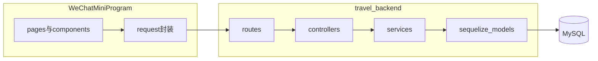

## 第5章 系统实现

本章围绕“旅行项目管理系统”的实际工程实现展开说明。系统采用微信小程序作为用户交互端，采用 Node.js、Express、Sequelize 与 MySQL 作为服务端，统一通过 REST 风格 API（前缀 `/api`）交互；身份认证采用 JWT，多媒体资源通过服务端 `/uploads` 目录的静态资源托管提供访问。整体遵循“表现层（小程序页面与组件）—接口层（路由与控制器）—业务层（Service）—数据访问层（Sequelize 模型）”的分层结构。核心数据实体与数据库设计文档中的 `users`、`projects`、`contents`、`locations`、`permissions` 等表保持一致；工程实现中另使用 `project_shares`、`friendships`、`invitation_codes` 等表支撑项目分享与好友邀请等业务能力，与第4章数据库设计在概念上为扩展关系，字段命名仍采用下划线蛇形命名法。

---

### 5.1 开发与运行环境及系统入口

#### 5.1.1 功能说明

说明系统运行所依赖的基础环境，以及小程序端工程入口与页面组织方式，为后续各业务模块实现提供上下文。

#### 5.1.2 实现方式

**后端运行环境**：后端工程声明 Node.js 18 及以上版本；主要依赖包括 Express（Web 框架）、Sequelize 与 mysql2（ORM 与数据库驱动）、jsonwebtoken（JWT）、multer（文件上传）、puppeteer（PDF 导出渲染）、qrcode（分享二维码生成），以及 exifr、`@tmcw/togeojson`、`@xmldom/xmldom` 等多媒体解析相关库（服务端图片 EXIF 与 GPX、KML 解析见 `travel-backend/src/utils/parser.js`）。

**小程序工程组织**：页面路由在 `TripTimeline/miniprogram/app.json` 中注册，涵盖首页旅途列表、时间地图、年度总览、内容浏览、编辑器、个人中心、项目编辑与项目详情等；底部导航采用自定义 `tabBar`（`tabBar.custom: true`），便于统一视觉与交互。

**应用级启动逻辑**：小程序在 `TripTimeline/miniprogram/app.ts` 的 `onLaunch` 中读取本地 `token`，若不存在则触发静默登录流程；在 `onShow` 中处理好友邀请码与剪贴板分享口令的解析与后续跳转，实现跨入口的业务衔接。

#### 5.1.3 关键实现点

- **Skyline 与组件框架**：`app.json` 中配置 `rendererOptions.skyline` 与 `componentFramework: glass-easel`，属于微信小程序新一代渲染与组件体系配置，用于提升渲染性能与布局能力。
- **全局业务钩子**：将“登录后补处理邀请码”“剪贴板分享链接识别”置于 `App` 生命周期，降低各页面重复实现成本。

---

### 5.2 网络通信、鉴权与错误处理基础能力

#### 5.2.1 功能说明

为各业务模块提供统一的 HTTP 请求封装、Token 注入、加载态与错误提示处理，并与后端 JWT 鉴权机制对齐。

#### 5.2.2 实现方式

小程序端在 `TripTimeline/miniprogram/utils/request.ts` 中封装 `wx.request`：自动拼接配置中的 `baseUrl`；对 GET 请求将 `data` 序列化为查询字符串；在请求头中附加 `Authorization: Bearer <token>`（从 `wx.getStorageSync('token')` 读取）；对 HTTP 非 2xx 与业务 `code` 错误进行提示，并在 401 场景清理本地凭证。

后端在 `travel-backend/src/middleware/auth.js` 中实现 `authMiddleware`：优先解析 `Authorization: Bearer`；为兼容在浏览器中直接打开导出链接等场景，额外支持通过查询参数 `access_token` 传递 JWT；校验失败返回 401。

业务路由在 `travel-backend/src/routes/index.js` 聚合，并统一挂载于 `travel-backend/src/app.js` 的 `/api` 路径下。

#### 5.2.3 关键实现点

- **资源 URL 归一化**：同文件中的 `asAbsoluteAssetUrl` 将相对路径资源转换为可访问的绝对地址，避免小程序端图片、音频等媒体加载失败。
- **鉴权与导出场景并存**：导出链接允许通过查询参数携带令牌，与小程序常规 Header 鉴权形成互补；实际部署中应配合 HTTPS、短时效令牌与最小权限策略降低风险。

---

### 5.3 用户认证与好友关系模块

#### 5.3.1 功能说明

完成用户身份建立（与微信侧标识关联）、维持登录态，并提供好友邀请码申请与兑换等能力，为“好友可见”类权限提供社交关系基础。

#### 5.3.2 实现方式

后端提供 `/api/auth/login` 等认证接口（见 `travel-backend/README.md`），登录成功后签发 JWT；好友相关接口挂载于 `/api/friends`，与小程序 `TripTimeline/miniprogram/utils/api.ts` 中的路径定义一致。

小程序端在 `TripTimeline/miniprogram/app.ts` 中：通过启动参数 `inviteCode` 捕获邀请码并暂存；在已登录条件下调用 `api.friend.applyInviteCode` 完成兑换；通过正则解析 `TripTimeline://share?projectId=…&shareId=…` 形式的剪贴板口令，引导用户进入分享浏览链路。

#### 5.3.3 关键实现点

- **静默登录与可重试**：默认不阻断首屏，失败时保留待处理状态以便下次进入继续尝试，兼顾可用性与数据最终一致性叙述需求。

---

### 5.4 旅行项目管理模块

#### 5.4.1 功能说明

支持用户创建与维护多个旅行项目，维护与 `projects` 表一致的元数据（如 `title`、`subtitle`、`cover_image`、`start_date`、`end_date`、`tags` 等），并提供列表检索、置顶、归档与物理删除等项目生命周期管理能力。

#### 5.4.2 实现方式

后端业务集中在 `travel-backend/src/services/projectService.js`：`listProjects` 支持关键词、标签、日期区间等过滤，并通过子查询统计含 `location_id` 的内容数量以辅助前端展示；`createProject` 校验必填字段后写入 `projects` 表；`updateProject` 在 `is_archived` 为已归档时限制对标题、封面等字段的修改，体现“归档即冻结”语义；`setProjectPinned` 维护 `is_pinned` 与 `pinned_at`，用于列表排序；`deleteProject` 在数据库事务中先删除该项目在 `permissions` 表中的项目级隐私规则，再物理删除 `projects` 行，并由外键级联删除关联的 `contents` 与 `project_shares` 等记录。

路由层在 `travel-backend/src/routes/projectRoutes.js` 中将项目相关接口纳入 `authMiddleware` 保护。

小程序端对应页面包括 `TripTimeline/miniprogram/pages/index/index.ts`（旅途列表）、`TripTimeline/miniprogram/pages/project-editor/project-editor.ts`（项目编辑）与 `TripTimeline/miniprogram/pages/project-detail/project-detail.ts`（项目详情）；并通过 `TripTimeline/miniprogram/utils/projectArchive.ts` 在前端对归档状态下的写入操作进行拦截，与后端 `contentService` 中的 `ensureProjectEditable` 逻辑相呼应。

#### 5.4.3 关键实现点

- **归档一致性**：前后端双重校验，降低误操作与越权修改风险。
- **列表可管理性**：置顶排序与多条件过滤，支撑项目数量增长后的可用性。

---

### 5.5 多媒体内容聚合与编辑模块

#### 5.5.1 功能说明

将照片、日记（富文本）、音频等内容以统一的内容节点模型纳入项目时间轴；字段层面与 `contents` 表一致，以 `content_type` 区分媒体类型，以 `content_data`（JSON）承载差异化字段；以 `record_time` 作为时间轴排序主键，以 `sort_order` 支持手动排序；通过可选外键 `location_id` 关联 `locations` 表实现地理位置绑定。

#### 5.5.2 实现方式

**服务端**：`travel-backend/src/services/contentService.js` 中，`createContent` 在请求体包含 `location` 且具备 `latitude`、`longitude` 时自动创建 `locations` 记录并回填 `location_id`，减少前端多次往返；`listContents` 使用 `include` 关联 `locations`（别名 `location`），并按 `record_time`、`sort_order` 升序排列；返回前调用 `privacyService.filterViewableContents`，保证列表与权限模型一致。更新与删除路径对归档项目同样执行可编辑性校验。

**小程序端**：`TripTimeline/miniprogram/pages/editor/editor.ts` 集成富文本编辑器（`editor` 组件上下文与 `setContents` 载入历史 HTML）、腾讯地图检索与逆地理编码（`TripTimeline/miniprogram/utils/tencentMap.ts`）、相册图片 EXIF 解析（`TripTimeline/miniprogram/utils/exif.ts`）以自动填充拍摄时间与坐标，并完成图片上传后的相对路径与预览绝对 URL 维护。

**服务端多媒体解析**：`travel-backend/src/utils/parser.js` 使用 `exifr` 解析图片 EXIF，使用 `togeojson` 将 GPX、KML 转为 GeoJSON 结构，为轨迹类 `content_type`（如 `track`）的扩展提供基础。

#### 5.5.3 关键实现点

- **JSON 承载差异化字段**：在保持第三范式主体拆分的前提下，用 `content_data` 吸收各媒体类型特有属性，控制表结构膨胀。
- **内容与位置解耦**：独立 `locations` 表与 `contents.location_id` 外键，便于地图聚合与位置复用。

---

### 5.6 时间地图与时空可视化模块

#### 5.6.1 功能说明

以“时间轴 + 地图”的方式呈现旅行记录：时间维度按日期聚合展示节点，空间维度在地图上标注带经纬度的内容；支持音频播放、分享浏览模式下的只读访问。另提供跨项目“年度总览”视图，将多次旅行沉淀为按年份组织的时间线与地图总览。

#### 5.6.2 实现方式

**单项目时间地图**：`TripTimeline/miniprogram/pages/timeline-map/timeline-map.ts` 在 `onShow` 中拉取项目详情与内容列表；内容列表请求在非所有者场景下携带 `share_id` 查询参数，与分享链路一致。将接口返回的记录映射为界面结构：按日期分组、对富文本做摘要去标签、图片数组做绝对 URL 转换、组装音频对象；地图侧维护 `markers`、`polylines` 等；通过 `wx.createInnerAudioContext` 管理音频播放，并在页面隐藏与卸载时释放资源。

**跨项目年度总览**：`TripTimeline/miniprogram/pages/year-review/year-review.ts` 调用 `GET /api/projects/timeline-map`；后端 `travel-backend/src/controllers/projectController.js` 中 `getTimelineMapData` 调用 `getTimelineMapOverview`（`travel-backend/src/services/projectService.js`），聚合当前用户多个项目及其带位置信息的内容点，前端再按年份重组时间轴与地图视野。

#### 5.6.3 关键实现点

- **时空数据同源**：同一批 `contents` 与关联 `locations` 同时支撑时间排序与地图绘点，体现“时间 + 空间”双维度叙事。
- **分享态与自有态复用页面**：通过 `shareId` 控制查询参数与访问模式，减少重复页面与分叉逻辑。

---

### 5.7 项目分享与导出模块

#### 5.7.1 功能说明

在权限允许前提下生成可传播的分享能力（含二维码、访问统计、撤销等），并将旅行内容导出为 HTML 纪念册与 A4 版式 PDF，满足成果化输出需求。

#### 5.7.2 实现方式

**分享**：`travel-backend/src/services/projectShareService.js` 在创建分享前读取项目级权限规则：当 `permissions.visibility` 对应私密时禁止生成分享；分享记录写入 `project_shares` 表，包含过期时间、撤销标记等；小程序在时间地图页通过 `shareVisit` 接口上报访问（见 `timeline-map.ts`）。

**导出**：`travel-backend/src/services/exportService.js` 构建 HTML 模板，并对本地图片等资源做 data URI 等嵌入处理；PDF 导出使用 puppeteer 将 HTML 打印为 A4。导出过程调用 `privacyService` 中的可见性判定与 `sanitizeLocation` 等逻辑，使导出范围与列表可见性原则一致，与《隐私控制机制》设计目标一致。

路由见 `travel-backend/src/routes/projectRoutes.js`：`GET /:id/exports/html` 与 `GET /:id/exports/pdf`。

#### 5.7.3 关键实现点

- **HTML 优先的 PDF 策略**：先统一为网页排版再打印为 PDF，降低双套排版成本并提升一致性。
- **分享与隐私联动**：从业务规则上禁止私密项目生成外部分享，降低误分享概率。

---

### 5.8 隐私控制与数据安全模块

#### 5.8.1 功能说明

实现项目级可见性规则（与 `permissions` 表中 `target_type`、`target_id`、`visibility`、`white_list` 等字段语义一致）、好友与白名单辅助判定、内容列表过滤、导出范围控制，并对地理位置做脱敏展示，落实最小暴露原则。

#### 5.8.2 实现方式

统一逻辑位于 `travel-backend/src/services/privacyService.js`：`visibility` 取 1、2、3 分别表示私密、好友可见、公开；通过 `getViewerLevel`、`canView` 等组合所有者、好友关系（`friendService`）与白名单判定；`sanitizeLocation` 对经纬度按精度圆整，`maskAddress` 对详细地址做简化；`filterViewableContents` 在 `contentService.listContents` 返回前剔除不可见节点。

项目隐私查询与更新接口为 `GET`、`PUT /api/projects/:id/privacy`，路由定义于同一项目路由模块中。

#### 5.8.3 关键实现点

- **单一判定源**：权限与脱敏集中在 Service 层，避免控制器重复实现与规则漂移。
- **展示侧脱敏**：在保留地图可用性的前提下，通过坐标精度与地址掩码降低敏感地理信息泄露风险。

---

### 5.9 本章小结

本章从运行环境、网络与鉴权基础、用户与好友关系、旅行项目管理、多媒体内容与编辑、时间地图与年度总览、项目分享与导出、隐私控制等方面，说明了系统的主要实现路径与关键工程点。实现上结合微信小程序能力（地图、富文本编辑器、音频播放、本地存储）与 Node.js 技术栈（Express、Sequelize、Puppeteer、二维码与多媒体解析库），形成可运行、可扩展的技术闭环，并与数据库设计中的核心表结构及字段命名保持一致。
